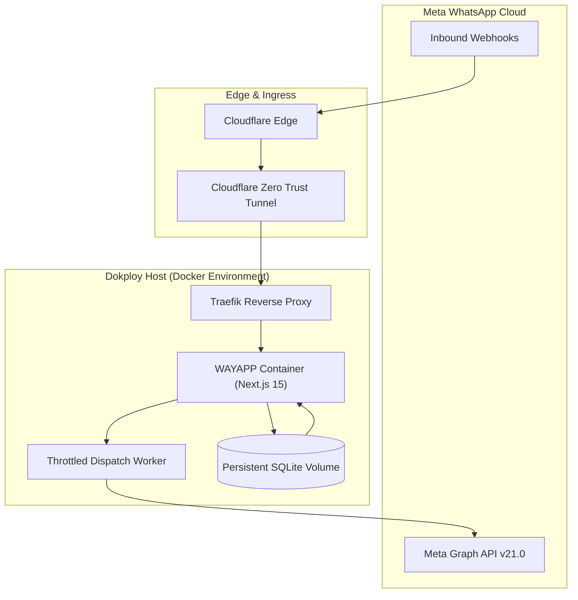

<p align="center">
  
</p>

<p align="center">
  <strong>Enterprise self-hosted WhatsApp Marketing, Template Studio & Live 2-Way Inbox powered by Meta Cloud API.</strong>
</p>

<p align="center">
  <a href="https://github.com/usmankhan4001/WAYAPP/blob/main/LICENSE"></a>
  <a href="https://nextjs.org/"></a>
  <a href="https://react.dev/"></a>
  <a href="https://www.typescriptlang.org/"></a>
  <a href="https://www.prisma.io/"></a>
  <a href="https://developers.facebook.com/docs/whatsapp/cloud-api"></a>
  <a href="https://docker.com"></a>
</p>

---

## Table of Contents

- [Overview](#overview)
- [Why WAYAPP vs Commercial SaaS](#why-wayapp-vs-commercial-saas)
- [Key Features](#key-features)
- [Architecture](#architecture)
- [Quick Start (Local Development)](#quick-start-local-development)
- [Dokploy & Cloudflare Tunnel Deployment](#dokploy--cloudflare-tunnel-deployment)
- [Meta WhatsApp Cloud API Configuration](#meta-whatsapp-cloud-api-configuration)
- [Environment Variables](#environment-variables)
- [Project Structure](#project-structure)
- [Contributing](#contributing)
- [License](#license)

---

## Overview

**WAYAPP** (*dablew aay yapp*) is an enterprise-grade, single-tenant WhatsApp Broadcast, Marketing Automation, and 2-Way Live Customer Support platform. Built on the official **Meta WhatsApp Business Cloud API (Graph API v21.0)**, WAYAPP lets you send high-volume campaigns, manage interactive templates, segment audiences, and chat with customers without paying monthly markups or per-conversation SaaS fees.

---

## Why WAYAPP vs Commercial SaaS

| Capability | Commercial SaaS (WATI, Interakt, etc.) | **WAYAPP (Self-Hosted)** |
| :--- | :--- | :--- |
| **Pricing** | High monthly tier ($49–$299/mo) + markup fees | **$0 / Free & Open Source (Pay Meta directly)** |
| **Data Privacy** | Customer contacts stored on 3rd-party servers | **100% On-Premise / Single-Tenant SQLite/PostgreSQL** |
| **Meta Graph API** | Often locked into legacy APIs | **Official Graph API v21.0 with HMAC Validation** |
| **Broadcast Engine** | Arbitrary sending queues & rate caps | **Tunable concurrency & throttled dispatch (20+ msgs/s)** |
| **Customization** | Rigid vendor dashboards | **Modern Next.js 15 App Router & Tailwind CSS** |
| **Deployment** | Vendor hosted only | **1-Click Docker / Dokploy / Cloudflare Wildcard Tunnels** |

---

## Key Features

### 1. 3-Step Meta Activation Gatekeeper
- Validates Phone Number ID, WABA ID, and Permanent System User Access Token against Meta's live endpoints before unlocking the dashboard.
- Includes a **Virtual Mock Simulator** mode for immediate testing without live credentials.

### 2. Interactive Template Studio & Live Mockup
- Synchronizes approved templates directly from Meta Business Manager.
- Interactive WhatsApp mobile phone simulator showing real-time text, variable interpolations (`{{1}}`, `{{2}}`), dynamic image headers, and Quick Reply / CTA URL buttons.
- Direct test-message dispatcher to preview approved templates on your own phone.

### 3. Audience Segmentation & Smart CSV Import
- Import thousands of contacts via CSV with automatic E.164 phone formatting and country code normalization.
- Tag taxonomies, group memberships, and arbitrary JSON custom attributes (`company`, `tier`, `balance`).
- Dynamic audience deduplication calculator for broadcast budgeting.

### 4. Throttled Campaign Broadcast Wizard
- 4-step wizard: Setup &rarr; Audience Filtering &rarr; Variable Mapping &rarr; Live Launch.
- Configurable concurrency and rate-limiter (default: 20 msgs/sec) to stay within Meta account throughput limits.
- Background worker with instant pause, resume, and real-time execution telemetry.

### 5. Real-Time Webhook Pipeline & Funnel Telemetry
- Real-time message status lifecycle tracking:
  - Targeted &rarr; Dispatched &rarr; Delivered &rarr; Read &rarr; Replied
- Failure diagnostics tracking exact Meta error codes (e.g. `131026: Message Undeliverable`, `131047: 24h Window Re-engagement`).

### 6. Omnichannel Live 2-Way Inbox
- Full customer service chat interface for replying to incoming inquiries within the 24-hour customer care window.
- Visual session countdown timer showing remaining customer care window validity.

---

## Architecture



---

## Quick Start (Local Development)

### Prerequisites
- Node.js 20+ installed
- npm or pnpm
- (Optional) Meta WhatsApp Cloud API credentials or use built-in simulator

### 1. Clone & Install
```bash
git clone https://github.com/usmankhan4001/WAYAPP.git
cd WAYAPP
npm install
```

### 2. Environment Setup
```bash
cp .env.example .env
```

### 3. Database Migration
```bash
npx prisma db push
```

### 4. Run Development Server
```bash
npm run dev
```
Open **[http://localhost:3000](http://localhost:3000)** to launch the WAYAPP Setup Gatekeeper.

---

## Dokploy & Cloudflare Tunnel Deployment

Deploy WAYAPP to your Dokploy server:

1. **Create Application in Dokploy**:
   - Application Type: **Docker / Git Repository**
   - Repository: `https://github.com/usmankhan4001/WAYAPP.git`
   - Branch: `main`
   - Build Type: **Dockerfile**

2. **Configure Persistent SQLite Volume**:
   - **Mount Path**: `/app/prisma`
   - **Volume Name**: `wayapp_storage`

3. **Set Environment Variables in Dokploy**:
   ```ini
   NODE_ENV=production
   PORT=3000
   DATABASE_URL=file:/app/prisma/dev.db
   NEXT_PUBLIC_APP_URL=https://whatsapp.yourdomain.com
   ```

4. **Connect Domain**:
   - Set domain to `whatsapp.yourdomain.com` routed via your Cloudflare Wildcard Tunnel to container port `3000`.

---

## Meta WhatsApp Cloud API Configuration

1. In the [Meta for Developers Portal](https://developers.facebook.com/), open your WhatsApp App &rarr; **Configuration**.
2. Set **Callback URL**:
   ```
   https://whatsapp.yourdomain.com/api/webhooks/whatsapp
   ```
3. Set **Verify Token**: Match the token configured during WAYAPP initial setup.
4. Under **Webhook fields**, subscribe to:
   - `messages` (inbound chats & delivery status updates)
   - `message_template_status_update` (template approvals/rejections)

---

## Environment Variables

| Variable | Description | Default | Required |
| :--- | :--- | :--- | :--- |
| `DATABASE_URL` | SQLite database connection string | `file:./dev.db` | **Yes** |
| `NEXT_PUBLIC_APP_URL` | Public URL for webhook and callback routing | `http://localhost:3000` | **Yes** |
| `NODE_ENV` | Runtime environment (`development` / `production`) | `development` | No |
| `PORT` | Web server listening port | `3000` | No |

---

## Project Structure

```
WAYAPP/
├── .github/                  # GitHub Actions CI, issue templates, assets
│   ├── assets/               # Brand banners, architecture diagrams
│   ├── ISSUE_TEMPLATE/       # Bug reports & feature requests
│   └── workflows/ci.yml      # CI build & typecheck pipeline
├── prisma/
│   ├── schema.prisma         # Database schema (Contacts, Campaigns, Messages, Templates)
│   └── seed.ts               # Sample development seed data
├── public/
│   ├── favicon.svg           # High-resolution vector favicon
│   └── logo.svg              # Official brand logo
├── src/
│   ├── app/                  # Next.js App Router (Analytics, Campaigns, Contacts, Inbox, Templates)
│   ├── components/           # Modular UI component library
│   │   ├── analytics/        # Funnel charts & message log telemetry tables
│   │   ├── campaigns/        # Multi-step broadcast campaign wizard & progress cards
│   │   ├── common/           # Initial setup gatekeeper & Meta guide modals
│   │   ├── contacts/         # CSV importer, modal forms, tagging drawers
│   │   ├── inbox/            # 2-way real-time chat window
│   │   ├── layout/           # AppShell, responsive sidebar, navigation header
│   │   └── templates/        # Template builder & WhatsApp mobile previewer
│   └── lib/
│       ├── prisma.ts         # Prisma client singleton
│       ├── utils.ts          # Class merging & phone formatting utilities
│       └── whatsapp/         # Meta Graph API client, throttled queue, HMAC validator
├── Dockerfile                # Multi-stage optimized standalone Alpine image
├── docker-compose.yml        # Local containerization setup
└── README.md
```

---

## Contributing

Contributions are welcomed. Please read our [Contributing Guidelines](CONTRIBUTING.md) and [Code of Conduct](CODE_OF_CONDUCT.md) before submitting pull requests.

```bash
# Branch convention
git checkout -b feat/your-feature-name
```

---

## License

This project is licensed under the [MIT License](LICENSE) — free for personal and commercial usage.

<p align="center">
  Built for high-performance WhatsApp Business operations.
</p>
