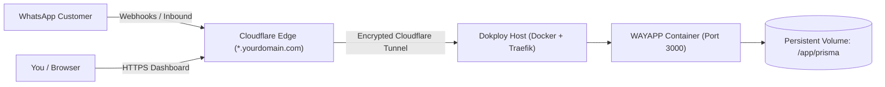

# ⚡ WAYAPP — WhatsApp Marketing & Broadcast Platform

[](https://nextjs.org/)
[](https://react.dev/)
[](https://prisma.io/)
[](https://tailwindcss.com/)
[](https://developers.facebook.com/docs/whatsapp/cloud-api)
[](https://docker.com)

**WAYAPP** is an enterprise single-tenant WhatsApp Broadcast, Template Marketing, and 2-Way Customer Inbox platform powered by the official **Meta WhatsApp Cloud API (Graph API v21.0)**.

---

## 🌟 Core Features

- **🔒 Initial Meta Activation Gatekeeper**: Guides you through a 3-step live handshake verification before unlocking the workspace.
- **📄 Template Manager**: Synchronize approved templates from Meta, create new templates with CTA buttons and image headers, and preview with a real-time WhatsApp mobile mockup.
- **👥 Audience Segmentation**: Organize contacts into static groups, tag taxonomies, and custom attributes (`company`, `vip`, etc.). Bulk CSV import with E.164 auto-formatting.
- **🚀 Broadcast Campaign Wizard**: 4-step wizard with inclusion/exclusion filters, live deduplicated audience calculation, dynamic variable interpolation (`{{1}}`, `{{2}}`), and rate-limited throttling (default: 20 msgs/sec).
- **📊 Real-Time Webhook Telemetry**: Live status pipeline tracking: `Targeted` $\rightarrow$ `Sent` $\rightarrow$ `Delivered (double grey ticks)` $\rightarrow$ `Read (double blue ticks)` $\rightarrow$ `Replied (24h conversation)` $\rightarrow$ `Failed (with Meta error code diagnostics)`.
- **💬 Live 2-Way Inbox**: Chat with customers responding to your broadcasts within the active 24-hour service conversation window.
- **📱 100% Mobile Responsive**: Slide-out navigation drawer, thumb-friendly 2-way inbox, and responsive data tables.
- **🐳 Dokploy & Docker Ready**: Multi-stage standalone Alpine container with persistent SQLite volume storage.

---

## 🚀 Quick Start (Local Development)

### 1. Install Dependencies
```bash
npm install
```

### 2. Initialize Database
```bash
npx prisma db push
```

### 3. Start Development Server
```bash
npm run dev
```
Open **`http://localhost:3000`** in your browser and complete the 3-step activation screen to connect your Meta WhatsApp account!

---

## 🐳 Dokploy & Cloudflare Wildcard Tunnel Deployment

### Architecture


### 1. Create Application in Dokploy
1. Log into your **Dokploy Dashboard**.
2. Create a new Application service (e.g. `wayapp`).
3. Select **GitHub / Git Repository** & branch `main`.
4. Set Build Type to **Dockerfile** (`./Dockerfile`).

### 2. Configure Persistent Volume (Crucial for SQLite)
- **Mount Path**: `/app/prisma`
- **Volume Name**: `wayapp_data`

### 3. Set Environment Variables
```ini
NODE_ENV=production
PORT=3000
DATABASE_URL=file:/app/prisma/dev.db
```

### 4. Configure Domain
- **Domain**: `whatsapp.yourdomain.com` (or `wayapp.yourdomain.com` matching your Cloudflare wildcard tunnel).
- **Container Port**: `3000`.

### 5. Deploy & Connect Webhook
1. Click **Deploy**.
2. Open `https://whatsapp.yourdomain.com` and activate your Meta connection.
3. In Meta Developer Portal &gt; **WhatsApp &gt; Configuration**, set your Callback URL:
   ```
   https://whatsapp.yourdomain.com/api/webhooks/whatsapp
   ```
4. Subscribe to `messages` and `message_template_status_update`.

---

## 📄 License
Private & Proprietary. Built for high-volume business WhatsApp operations.
