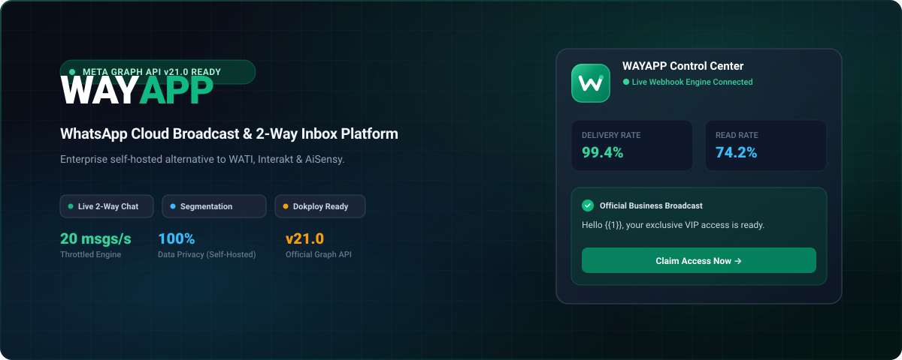

<p align="center">
  
</p>

<p align="center">
  <strong>Enterprise self-hosted WhatsApp Marketing, Visual Flow Builder, AI Agents, Multi-Agent Team Inbox & REST API Gateway powered by Meta Cloud API.</strong>
</p>

<p align="center">
  <a href="https://github.com/usmankhan4001/WAYAPP/blob/main/LICENSE"></a>
  <a href="https://nextjs.org/"></a>
  <a href="https://react.dev/"></a>
  <a href="https://www.typescriptlang.org/"></a>
  <a href="https://www.prisma.io/"></a>
  <a href="https://developers.facebook.com/docs/whatsapp/cloud-api"></a>
  <a href="https://docker.com"></a>
</p>

---

## Table of Contents

- [Overview](#overview)
- [Why WAYAPP vs Commercial SaaS](#why-wayapp-vs-commercial-saas)
- [Core Features & Modules](#core-features--modules)
  - [1. Visual Flow Builder (No-Code Funnels)](#1-visual-flow-builder-no-code-funnels)
  - [2. Multi-Provider AI & Keyword Chatbots](#2-multi-provider-ai--keyword-chatbots)
  - [3. AI Knowledge Base & RAG Generator](#3-ai-knowledge-base--rag-generator)
  - [4. Multi-Agent Team Inbox & 24h Window](#4-multi-agent-team-inbox--24h-window)
  - [5. Broadcast Dispatcher & Recovery Sweeper](#5-broadcast-dispatcher--recovery-sweeper)
  - [6. Public REST API v1 & Outbound Webhooks](#6-public-rest-api-v1--outbound-webhooks)
  - [7. Cross-Platform Expo Native Mobile App](#7-cross-platform-expo-native-mobile-app)
- [Security & Architecture](#security--architecture)
- [Docker Compose Deployment (Postgres + Web + Worker)](#docker-compose-deployment-postgres--web--worker)
- [API Reference & OpenAPI Specification](#api-reference--openapi-specification)
- [Database Backups & Disaster Recovery](#database-backups--disaster-recovery)
- [Testing & Quality Assurance](#testing--quality-assurance)
- [License](#license)

---

## Overview

**WAYAPP** is a complete, self-hosted enterprise WhatsApp Cloud API Gateway and Marketing Automation Suite. Built on **Meta WhatsApp Business Cloud API (Graph API v21.0)**, WAYAPP empowers businesses to broadcast personalized campaigns to millions of contacts, construct visual drag-and-drop conversational funnels, train 24/7 AI agents on internal knowledge bases, and collaborate across agent teams with zero monthly SaaS markup.

---

## Why WAYAPP vs Commercial SaaS

| Capability | Commercial SaaS (WATI, Interakt, etc.) | **WAYAPP Enterprise** |
| :--- | :--- | :--- |
| **Pricing** | $49–$499/mo + high per-message markup | **$0 / 100% Free & Open Source (Direct Meta billing)** |
| **Data Privacy** | Contacts hosted on multi-tenant servers | **Self-hosted single-tenant PostgreSQL / SQLite** |
| **Flow Builder** | Expensive add-on feature | **Full visual node builder with interactive simulator** |
| **AI Assistants** | Costly monthly add-on tokens | **Multi-provider (Gemini, Claude, GPT-4o, OpenRouter)** |
| **Team Routing** | Limited agent seats | **Unlimited agents with round-robin auto-assignment** |
| **API & Integrations** | Restricted webhook triggers | **Public REST API v1 + HMAC-signed Outbound Webhooks** |
| **Mobile App** | Generic web wrappers | **Native Expo SDK 52 React Native mobile application** |

---

## Core Features & Modules

### 1. Visual Flow Builder (No-Code Funnels)
- Visual canvas powered by `@xyflow/react` for crafting multi-step conversational journeys.
- Node palette: `Trigger`, `Message`, `Quick Reply Buttons`, `Conditions`, `Actions (Tags/Groups)`, and `End`.
- Dynamic template variable preview (`{{firstName}}`, `{{company}}`).
- Built-in **Live Flow Simulator** drawer to test chat funnels directly inside the browser.

### 2. Multi-Provider AI & Keyword Chatbots
- Deploy intelligent WhatsApp AI agents powered by **Google Gemini 2.5**, **OpenAI GPT-4o**, **Anthropic Claude 3.5**, or **OpenRouter (Meta Llama 3.3)**.
- Fast keyword responders (`CONTAINS`, `EXACT`, `STARTS_WITH`, `REGEX`).
- HTTP Webhook bots to bridge conversations to custom external microservices.
- Automatic rate pacing and anti-loop response guards.

### 3. AI Knowledge Base & RAG Generator
- One-click transformation of raw notes, website text, or FAQ docs into structured knowledge chunks.
- BM25 and keyword retrieval-augmented generation (RAG) providing accurate grounding for AI agents.

### 4. Multi-Agent Team Inbox & 24h Window
- Real-time customer threads with assignment filtering (`All`, `Assigned to Me`, `Unassigned`, `Resolved`).
- **Round-Robin Auto-Assignment** button for fair team distribution.
- Internal agent collaboration notes and timeline event auditing.
- Strict **24-Hour WhatsApp Service Window Compliance Guard** preventing accidental Meta policy violations.

### 5. Broadcast Dispatcher & Recovery Sweeper
- Standalone background worker (`src/worker/index.ts`) decoupled from web request lifecycles.
- Token-bucket rate limiter matching Meta account tier speed (default: 20–80 msgs/s).
- Self-healing recovery sweeper reclaiming stranded broadcasts on container restarts.
- Auto-suppression on Meta Error 130472 or customer `STOP` opt-outs.

### 6. Public REST API v1 & Outbound Webhooks
- Secure SHA-256 API Key authentication with scope enforcement (`contacts:read`, `messages:send`, etc.).
- OpenAPI 3.0 specification available at `/openapi.json` and interactive Swagger UI at `/api/v1/docs`.
- HMAC-SHA256 customer webhook endpoints with exponential backoff and test-ping verification.

### 7. Cross-Platform Expo Native Mobile App
- Native iOS and Android application located in `mobile/` built on Expo SDK 52.
- Secure token storage, real-time push notifications, and live 2-way chat with 24-hour service status.

---

## Docker Compose Deployment (Postgres + Web + Worker)

### 1. Configure Environment
```bash
cp .env.example .env
# Set AUTH_SECRET (generate with: openssl rand -base64 48)
```

### 2. Start Services
```bash
docker-compose up -d --build
```
This starts 3 production containers:
- **`wayapp-postgres`**: PostgreSQL 16 Alpine with persistent data volume.
- **`wayapp-web`**: Next.js 15 App Router web interface on port `3000`.
- **`wayapp-worker`**: Dedicated background dispatch and webhook runner.

---

## Database Backups & Disaster Recovery

### Automated Backup
```bash
./scripts/backup-db.sh
```
Creates a compressed snapshot in `./backups/wayapp_backup_YYYYMMDD_HHMMSS.sql.gz`.

### Restore Backup
```bash
./scripts/restore-db.sh ./backups/wayapp_backup_20260818_120000.sql.gz
```

---

## Testing & Quality Assurance

WAYAPP includes a comprehensive test suite covering security primitives, JWT tokens, webhook HMAC signatures, rate limiters, and phone number sanitization:

```bash
# Run Vitest test suite
npm test
```

---

## License

This project is licensed under the [MIT License](LICENSE) — free for personal and commercial usage.

<p align="center">
  <strong>Built for high-performance WhatsApp Business operations.</strong>
</p>
