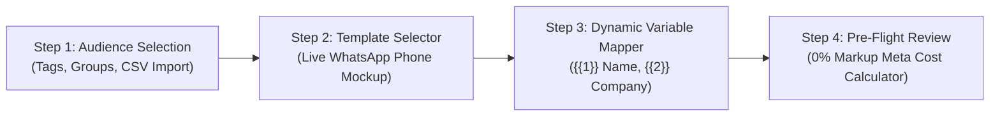

# 📢 Broadcast Campaigns & 0% Markup Meta Rate Calculator

WAYAPP's Broadcast Campaign Engine allows marketing and sales teams to schedule and dispatch personalized WhatsApp broadcasts to thousands of contacts with real-time phone mockups, dynamic variable mapping, and exact **0% markup Meta cost calculation**.

---

## 🚀 The 3-Step Campaign Wizard

### Step 1: Audience Filtering & Deduplication
* Select target contacts by **Static Groups**, **Tags**, or **All Contacts**.
* Exclude specific suppression lists (e.g. customers who already purchased or opted out).
* The engine calculates the **exact deduplicated audience count** in real time before scheduling.

### Step 2: Template Selection & Live Phone Mockup
* Select from official Meta-approved WhatsApp Business templates.
* The visual phone preview renders header media (Image, Video, Document), template body text, footer disclaimer, and interactive Call-To-Action (CTA) / Quick Reply buttons.

### Step 3: Dynamic Variable Mapping
* Maps template placeholders (`{{1}}`, `{{2}}`, `{{3}}`) to recipient contact properties:
  * `{{1}}` $\rightarrow$ `Contact First Name`
  * `{{2}}` $\rightarrow$ `Company Name`
  * `{{3}}` $\rightarrow$ `Custom Promo Code`
* Renders instant sample personalized previews for verification.

### Step 4: Pre-Flight Review & 0% Markup Rate Calculator
* **Throttled Duration**: Estimates dispatch time based on your configured rate limit (e.g. 20 msgs/second $\approx$ 1,000 msgs in 50 seconds).
* **0% Surcharge Meta Cost Breakdown**: Displays exact Meta conversation costs in USD (Marketing conversations $\approx \$0.045$ / conversation) with **$0.00 platform markup**.
