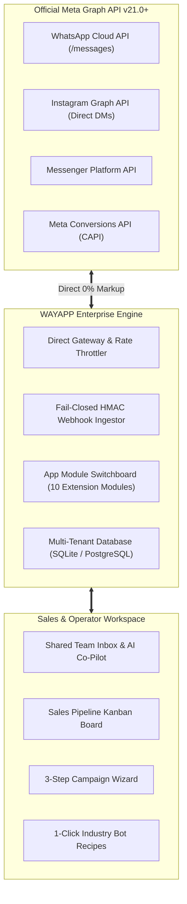

# 🌟 Welcome to the WAYAPP Enterprise Wiki

**WAYAPP Enterprise** is a first-party, high-throughput WhatsApp Business Platform & Omnichannel Sales Suite directly integrated with **Meta Cloud API v21.0+** with **0% markup**, **zero intermediate middleware hops**, and a **1-click toggleable modular architecture**.

Unlike third-party proxy SaaS intermediaries (which introduce vendor lock-in, recurring per-message surcharges, and data privacy risks), WAYAPP connects directly from your cloud infrastructure to Meta Graph API servers, giving you complete data sovereignty, native Meta capabilities, and maximum speed.

---

## 📚 Master Wiki Navigation

### 🏗️ Architecture & Core Foundation
* 📘 [Architecture & Direct Connector vs Middleware](Architecture-&-Direct-Connector.md)
* 🛡️ [Security, HMAC Verification & 24h Service Window](Security-&-Compliance-Guide.md)
* 🧩 [App Marketplace & Toggleable Modules Switchboard](App-Marketplace-&-Modules.md)

### 💼 Sales Team Workspace & AI Tools
* ⚡ [Sales Suite: AI Co-Pilot, Snippets (/) & In-Chat CRM](Sales-Suite-&-AI-Copilot.md)
* 📊 [Visual Sales Pipeline Kanban Board & Contact Audience](Sales-Suite-&-AI-Copilot.md#visual-sales-pipeline-kanban-board)

### 🌐 Omnichannel, Flows & E-Commerce
* 💬 [Multi-Channel Social Inbox (Instagram DMs & Messenger)](Multi-Channel-Social-Inbox.md)
* 📱 [Native Meta WhatsApp Flows 3.0 Interactive Forms](WhatsApp-Flows-3.0-Guide.md)
* 🛍️ [Shopify, WooCommerce & Meta Conversions API (CAPI)](E-Commerce-&-Meta-CAPI-Guide.md)

### 🚀 Campaigns & Bot Automation
* 📢 [Broadcast Campaigns & 0% Markup Meta Rate Calculator](Broadcast-Campaigns-&-Meta-Rates.md)
* 🤖 [No-Code Flow Builder & 1-Click Industry Bot Recipes](Automations-&-Bot-Recipes.md)

### 🛠️ Developer, DevOps & Operations
* ⚡ [Public Developer REST v1 API & Outbound Webhooks](Developer-REST-API-&-Webhooks.md)
* 🐳 [DevOps: Docker, GitHub CI/CD, CodeQL & Deployments](DevOps-CI-CD-&-Deployment.md)
* 🔍 [Troubleshooting & Meta Error Codes Directory](Troubleshooting-&-Meta-Error-Codes.md)

---

## ⚡ High-Level System Architecture

---

## 🎯 Quick Start Checklist for New Deployments
1. **Set Up Meta Developer App**: Create a Meta Business App with WhatsApp, Instagram, and Messenger products enabled.
2. **Register Business Phone Number**: Add your WhatsApp Business Phone Number ID and WABA ID in `/settings`.
3. **Configure Webhook**: Set Callback URL to `https://your-domain.com/api/webhooks/whatsapp` and copy the verify token.
4. **Choose Active Modules**: Go to `/settings` $\rightarrow$ **App Marketplace** to toggle your sales tools on/off.
5. **Invite Sales Agents**: Create accounts with role-based permissions (`ADMIN`, `MANAGER`, `AGENT`).
