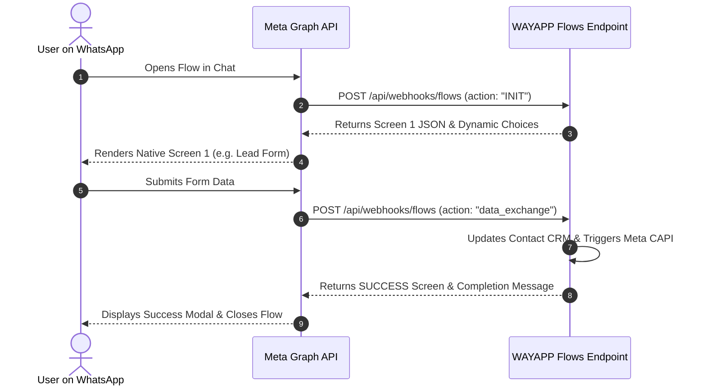

# 📱 Native Meta WhatsApp Flows 3.0 Guide

**WhatsApp Flows** allows businesses to build rich, interactive, native in-chat form experiences directly inside WhatsApp. Instead of redirecting users to external websites (which leads to high drop-off rates), users complete multi-step forms, book consultations, and select products without ever leaving the conversation.

---

## 🔄 Flows 3.0 Data Exchange Protocol

WAYAPP implements Meta's official Flows 3.0 Data Exchange endpoint at:
`POST /api/webhooks/flows`

---

## 🛠️ Supported Flow Types in WAYAPP

### 1. Lead Qualification & Budget Capture
* Fields: Full Name, Business Email, Company Name, Industry, Estimated Monthly Budget.
* Outcome: Automatically updates contact record in database, sets `leadStage` to `QUALIFIED`, tags as `WhatsApp Flow Lead`, and fires a `QualifiedLead` conversion event to Meta CAPI.

### 2. Appointment & Consultation Slot Booking
* Dynamic Choices: Displays real-time available time slots (e.g. Tomorrow 10:00 AM, Monday 2:00 PM).
* Outcome: Records booking time, assigns sales representative, and sends calendar confirmation.

### 3. Customer Satisfaction & Feedback Survey
* Fields: 1–5 Star Rating, NPS Score, Feedback Textarea.
* Outcome: Persists customer feedback and triggers instant alerts to management if rating $\le 2$ stars.

---

## 🔒 Security & Decryption
* **Encrypted Flow Payloads**: Supports AES-128-GCM payload encryption with RSA private keys when configured with Meta Business Manager.
* **Flow Token Correlation**: Correlates the `flow_token` directly with the customer's `contactId` or `phoneNumber` to prevent spoofing.
